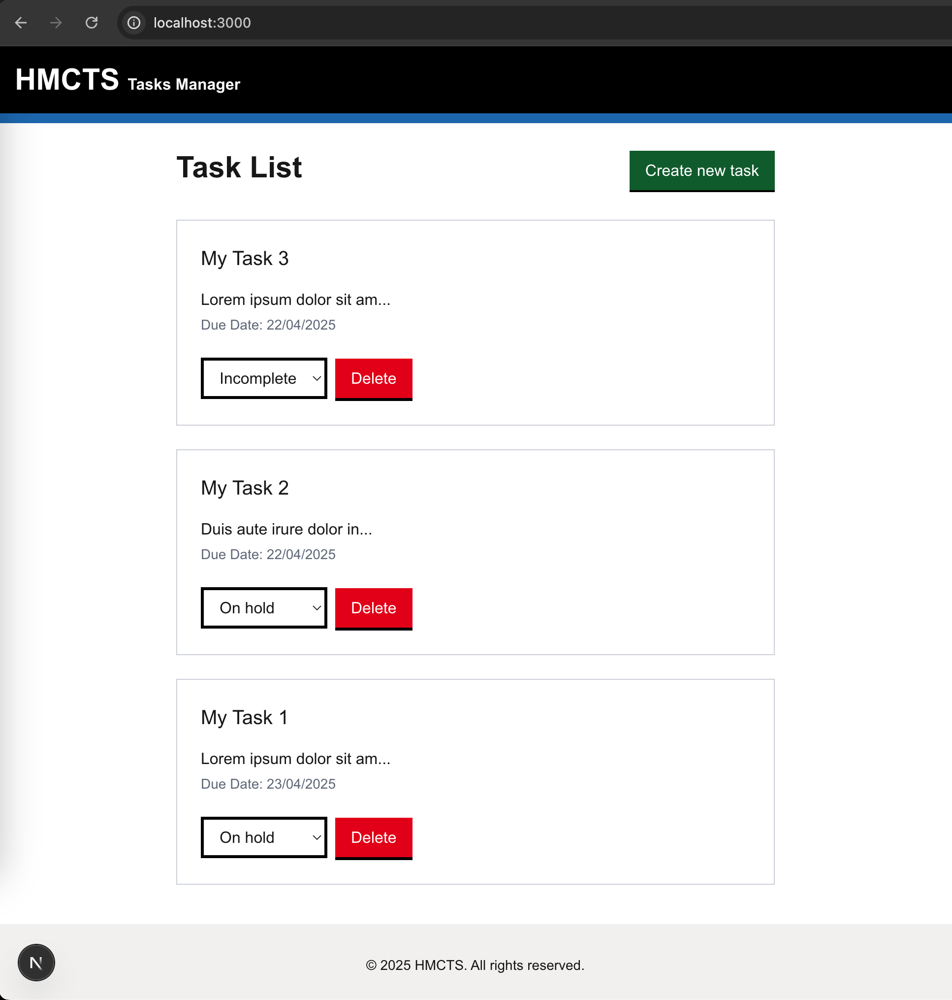
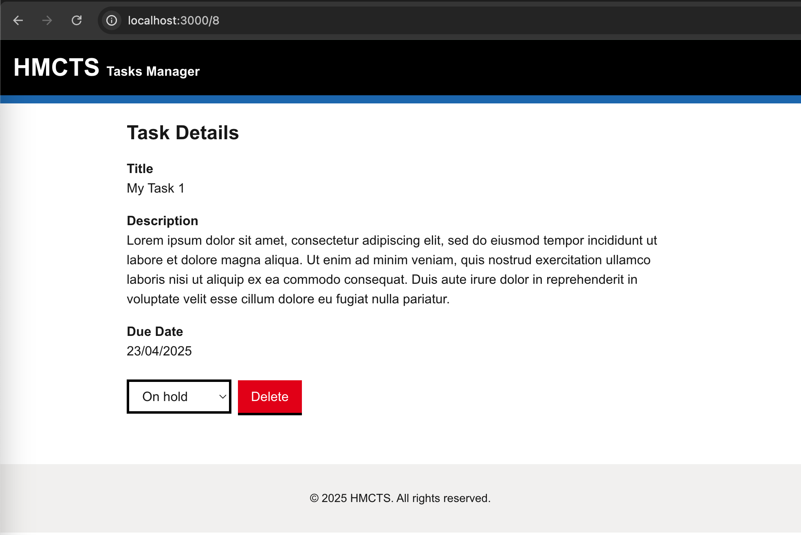

# HMCTS Task Manager

A task management application built with NextJS with support for basic CRUD ops.

## Screenshot
### List page


### Task detail page



## 🧩 Project Overview

This api supports:

- Task creation
- Viewing all tasks or a specific task by ID
- Updating task status
- Deleting tasks

## ⚙️ Tech Stack
- **Framework**: [Next.js](https://nextjs.org/) (App Router)
- **Styling**: [Tailwind CSS](https://tailwindcss.com/)
- **TypeScript**: For static typing
- **API Integration**: Fetches data from a backend task API

This is a [Next.js](https://nextjs.org) project bootstrapped with [`create-next-app`](https://nextjs.org/docs/app/api-reference/cli/create-next-app).

## Getting Started

```bash
git clone [repo-url]
cd [project-dir]
```

Run the development server:

```bash
npm run dev
```

Open [http://localhost:3000](http://localhost:3000) with your browser to see the result.

